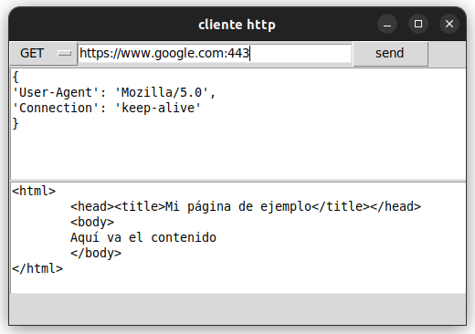

# Redes de computadoras 2024 
## Integrantes:
- ### Franco Hernández Piloto C311
- ### Hiván Cañizares Díaz C311
- ### Carlos Mauricio Reyes Escudero C311

#### Console
Para iniciarla basta con ejecutar `request_console.py` y hacer el request de la siguiente forma:
```
post http://cubadebate.cu:84 {'header1': 'value1 (ya se puede usar ;)', 'header2': 'value2'} (algo en el body)
```
> No pasar mas `{}`, pues la expresion regular las usa para determinar el fragmento correspondiente.

Tambien puede pasar algo en el body sin pasar headers:
```
get http://cubadebate.cu:84 (algo en el body)
```
> Los dos primeros parametros si son completamente necesarios.

#### GUI
Para iniciarla basta con ejecutar `request_gui.py`, mostrando la interfaz:

En esta se encuentra cada campo con el ejemplo que ilustra su fin, una vez se presiona `send` para enviar el request, los resultados apareceran en la consola en que se llama al `.py`